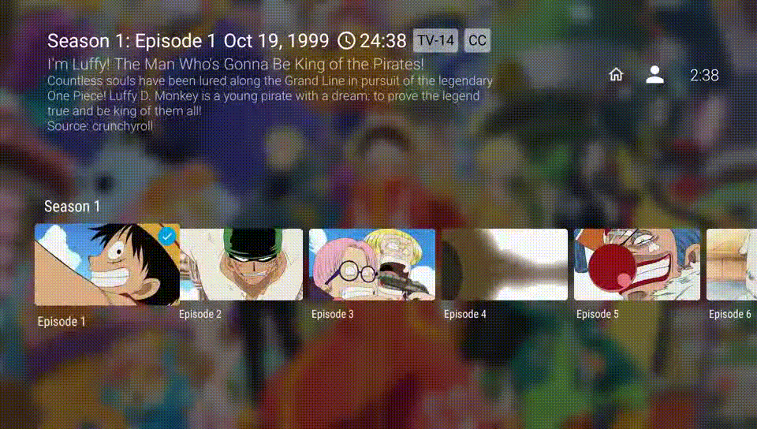

# New Feature in Progress

- [X] Add a control to jump to a specific episode by number.
  - Mimic the behavior of changing channels on a TV remote.
  
- [ ] Do not stop playing when time seeking\
I know there is this TrickPlay feature which shows thumbnails of video fragments when seeking but I still find having to 
press another key to actually execute seeking rather annoying. 

### 2024-08-04
This is actually the default behavior of leanback library. The relevant code is inside
`onSeekStarted()`of PlaybackTransportControlGlue.java. See below.
```java
        public void onSeekStarted() {
    mIsSeek = true;
    mPausedBeforeSeek = !isPlaying();
    mPlayerAdapter.setProgressUpdatingEnabled(true);
    // if we seek thumbnails, we don't need save original position because current
    // position is not changed during seeking.
    // otherwise we will call seekTo() and may need to restore the original position.
    mPositionBeforeSeek = mSeekProvider == null ? mPlayerAdapter.getCurrentPosition() : -1;
    mLastUserPosition = -1;
    pause();
}
```
It appears that the leanback library has made sure this behavior cannot be overridden...

### 2024-08-05
After failing to intercept key presses, which seem to bypass any code within the Jellyfin codebase,\
I managed to change the behavior by shadowing SeekUiClient. Its onSeekStarted() methods is called after keypresses are processsed.\
This sorta worked but the experience is rather choppy when I try to seek continuously.
- [ ] Shortcut key to access menu without scrolling all the way up
- [ ] Preferred audio and subtitle language setting per series
- [ ] Make seasons non mandatory for TV series (Most Asian TV series do not have seasons)
